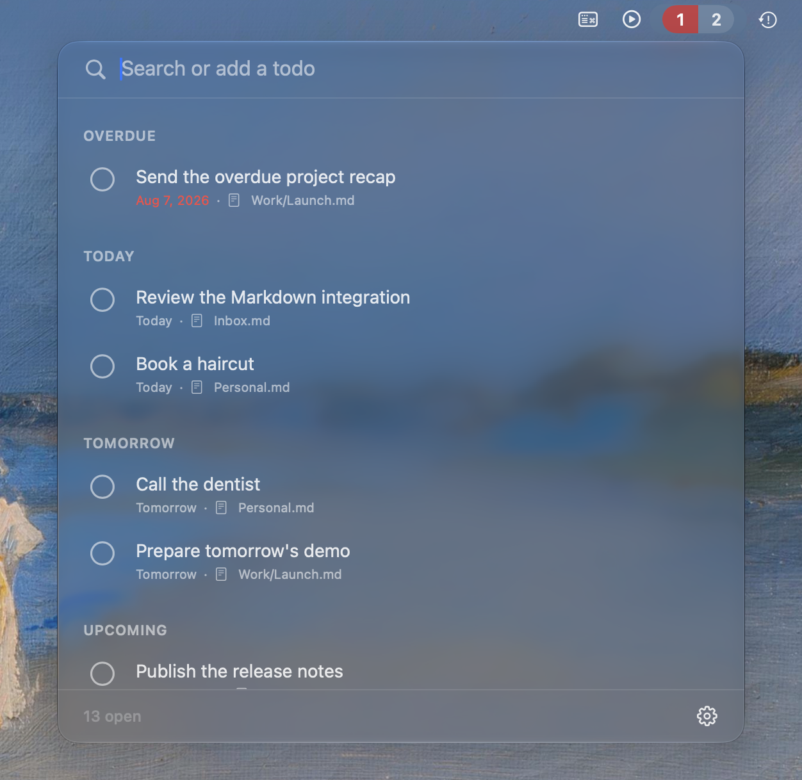

# Sundries

Sundries is a native macOS menu-bar task management companion. Sundries gathers tasks from various places, and has a well defined adapter interface to be extendable to various sources.

> Sundries is currently an early alpha right now, only markdown file source is working right now. Data formats and behavior may change

## Current features

- Liquid Glass menu-bar interface for reviewing and capturing tasks
- Overdue and due-today or total-open menu-bar counts
- Destination selection when adding a Markdown task
- Inline due-date presets and calendar selection
- Completion feedback with Undo

## Requirements

- macOS 26 or later
- Xcode 26 or later
- Swift 6

## Development

Open `Sundries.xcodeproj` and run the `Sundries` scheme.

## License

Sundries is available under the [MIT License](LICENSE).
